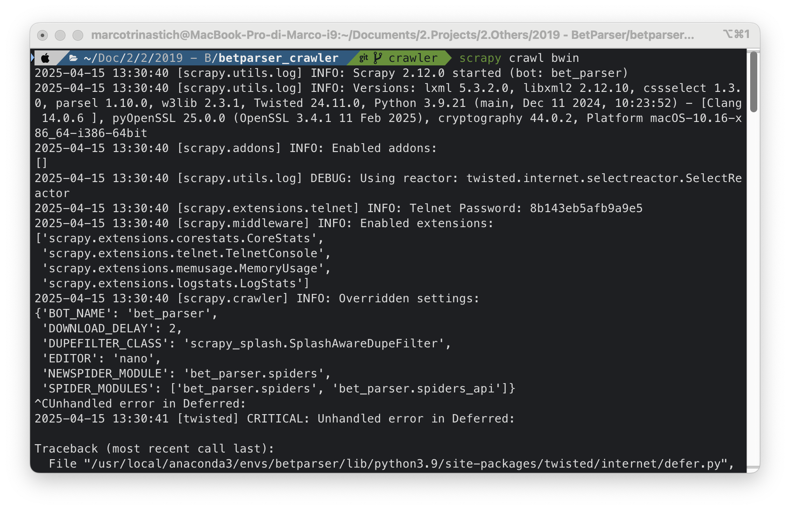
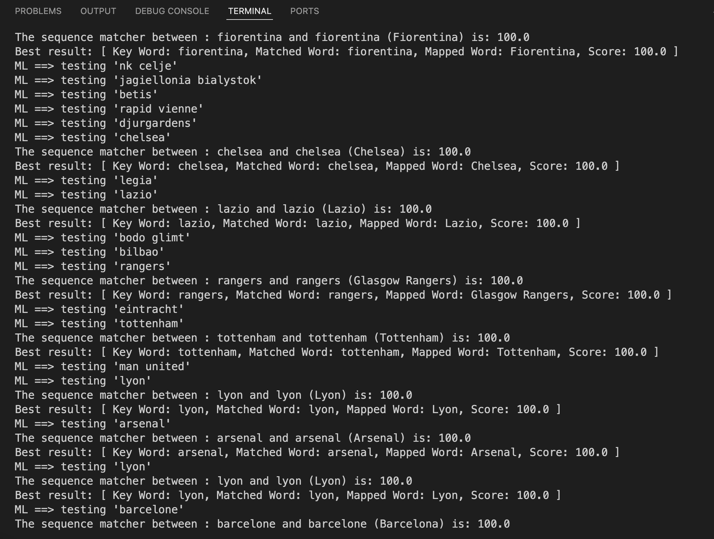
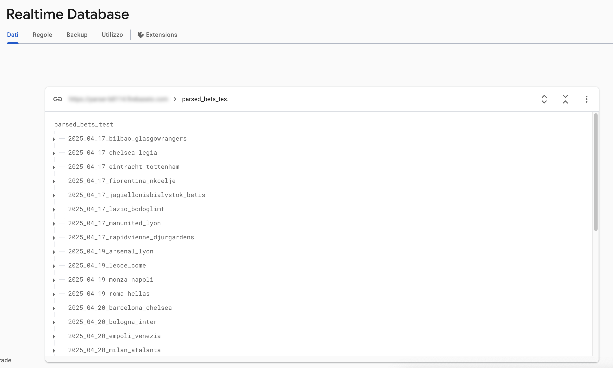
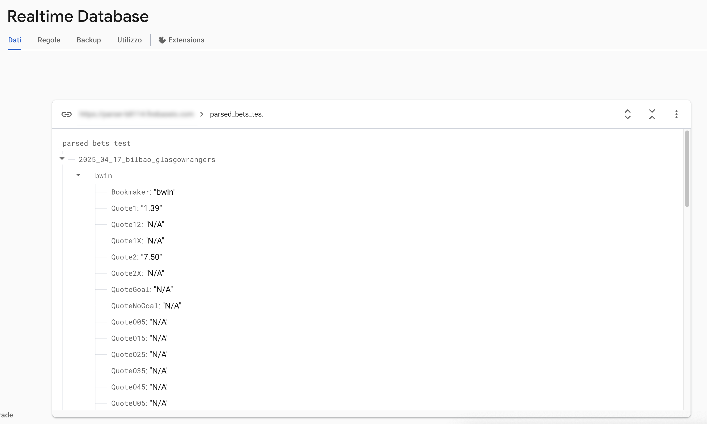

# BetParser Crawler

BetParser Crawler is a Python application designed to parse and extract betting odds from websites. It leverages the Scrapy framework, Firebase, custom Selenium integrations, and ML for efficient data extraction and processing.

## Disclaimer

This software is provided for educational and research purposes only. The authors of this project do not condone or encourage any illegal activities, including but not limited to unauthorized data scraping or infringement of intellectual property rights.

All trademarks, logos, and brand names mentioned in this project (e.g., Bwin, Bet365, William Hill, Sisal, Eurobet, etc.) are the property of their respective owners. The use of these names is for identification purposes only and does not imply endorsement or affiliation.

By using this software, you agree that the authors are not liable for any misuse or legal consequences arising from its use. It is your responsibility to ensure compliance with all applicable laws and regulations in your jurisdiction.

## Table of Contents

1. [Project Overview](#project-overview)
2. [Features](#features)
3. [Screenshots](#screenshots)
4. [Environment Setup](#environment-setup)
   - [Clone the Repository](#1-clone-the-repository)
   - [Install Anaconda3](#2-install-anaconda3)
   - [Configure an Environment](#3-configure-an-environment)
   - [Install Libraries](#4-install-libraries)
   - [Selenium Configuration](#5-selenium-configuration)
   - [Firebase Configuration](#6-firebase-configuration)
   - [Run/Debug](#7-rundebug)
5. [Development with Scrapy Framework](#development-with-scrapy-framework)
6. [Machine Learning Mapper - Word Similarity Algorithms](#machine-learning-mapper---word-similarity-algorithms)
7. [Optional Configurations](#optional-configurations)
   - [Splash Middleware](#splash-middleware-configuration)
   - [Tor and Custom Proxy Middlewares](#tor-and-custom-proxy-middlewares)
   - [Google Translator Mapper](#google-translator-mapper)
8. [License](#license)

## Project Overview

BetParser Crawler simplifies the process of extracting betting odds from web pages. It supports parsing complex JavaScript-powered pages using Selenium and includes machine learning algorithms to standardize team names. The project is highly configurable and integrates with Firebase for real-time database updates.

## Features

- **Web Scraping**: Extract betting odds from multiple websites using Scrapy spiders.
- **JavaScript Rendering**: Handle JavaScript-heavy pages with Selenium and Splash integrations.
- **Machine Learning**: Standardize team names using machine learning algorithms for word similarity.
- **Firebase**: Integrate with Firebase for real-time database updates.
- **Configurable Spiders**: Pre-configured spiders for well-known brokers like Bwin, Bet365, William Hill, Sisal, and Eurobet.
- **Proxy Support**: Enable proxy rotation and Tor to avoid bans during scraping.

## Screenshots

Here are some screenshots of the application in action:

### 1. Scrapy Spider Output



### 2. Selenium Middleware in Action


### 3. Machine Learning Mapper



### 4. Firebase Integration




## Environment Setup

### 1) Clone the Repository

Clone this repository to your local machine using:

```bash
git clone https://github.com/mtmarco87/betparser_crawler.git
```

### 2) Install Anaconda3

Download and install Anaconda3 with Python 3 from the [Anaconda Download Page](https://www.anaconda.com/distribution/#download-section).

### 3) Configure an Environment

1. Open the Anaconda prompt.
2. Create a new environment with Python 3.9:
   ```bash
   conda create -n <env_name> python=3.9
   ```
3. Activate the environment:
   ```bash
   conda activate <env_name>
   ```
4. Manage environments with the following commands:
   - `conda deactivate` - Deactivate the current environment.
   - `conda env list` - List all environments.
   - `conda env remove -n <env_name>` - Remove an environment.

### 4) Install Libraries

1. Activate your environment:
   ```bash
   conda activate <env_name>
   ```
2. Install dependencies:
   ```bash
   pip install -r requirements.txt
   ```
3. Alternatively, install libraries individually:
   ```bash
   pip install Scrapy Scrapy-UserAgents scrapy-splash selenium firebase-admin numpy nltk Unidecode googletrans stem torrequest urllib3 requests pytz
   ```
4. If issues arise, install specific versions:
   ```bash
   pip install Scrapy==2.12.0 Scrapy-UserAgents==0.0.1 scrapy-splash==0.11.1 selenium==4.31.0 firebase-admin==6.7.0 numpy==2.0.2 nltk==3.9.1 Unidecode==1.3.8 googletrans==2.4.0 stem==1.7.1 torrequest==0.1.0 urllib3==2.4.0 requests==2.32.3 pytz==2025.2
   ```

### 5) Selenium Configuration

Selenium is a powerful tool for interacting with JavaScript-heavy pages. It allows automated web testing and renders pages as they would appear in a browser. BetParser includes a custom Scrapy-Selenium middleware for handling complex, JS/Angular-powered pages.

### Steps to Configure Selenium:

1. **Install Chrome or Firefox**:

   - You can use either Chrome or Firefox for Selenium.

   - **Chrome (recommended)**:

     - Download and install Chrome if not already installed.
     - (Optional) Download the appropriate [Chrome WebDriver](https://chromedriver.chromium.org/downloads) for your OS and place it in the project folder: `bet_parser/libs/selenium_drivers/chromedriver`.
     - If you do not download and specify a driver path in the settings, the middleware will attempt to automatically download the ChromeDriver.

   - **Firefox**:
     - Download and install Firefox if not already installed.
     - (Optional) Download the appropriate [GeckoDriver](https://github.com/mozilla/geckodriver/releases) for your OS and place it in the project folder: `bet_parser/libs/selenium_drivers/geckodriver`.
     - If you do not download and specify a driver path in the settings, the middleware will attempt to automatically download the GeckoDriver.

2. **Create a Chrome Browser Profile**:

   - Open Chrome and create a new user profile.
   - Locate the profile folder on your system (search online for instructions specific to your OS).
   - Copy the profile folder to: `bet_parser/libs/selenium_drivers/chrome_profiles`.

3. **Update Settings**:

   - Edit `bet_parser/settings.py` in the "Selenium config" section. Update the following:

     - `SELENIUM_CHROME_USER_DATA_DIR`: Path to the Chrome profile folder.
     - `SELENIUM_CHROME_DRIVER` (optional): Path to the ChromeDriver binary. Set to `None` for automatic driver management or specify the path if you want to use a custom driver.
     - `SELENIUM_FIREFOX_DRIVER` (optional): Path to the GeckoDriver binary. Set to `None` for automatic driver management or specify the path if you want to use a custom driver.

   - You only need to configure the settings for the browser you plan to use (Chrome or Firefox).

4. **Handle Protected Pages**:

   - Some websites allow pages to be displayed only after user interactions. Use the Chrome profile to manually visit these pages and accept any banners or prompts to generate valid cookies.
   - Selenium will use this profile to access these pages during scraping.

By following these steps, the Selenium middleware will be ready to handle complex pages effectively.

> **Middleware Features**
>
> - The middleware creates a temporary copy of the Chrome profile to avoid bloating the folder.
> - `SeleniumMiddleware` / `SeleniumRequest` parameters include:
>   - `driver`: Can be `'chrome'` or `'firefox'`.
>   - `render_js`: Set to `true` to extract the fully rendered DOM using JavaScript execution; set to `false` for standard HTML extraction with Selenium.
>   - `wait_time` and `wait_until`: Define wait conditions for page rendering.
>   - `headless`: Run in headless mode (no browser window).
>   - `script`: Execute custom JavaScript before extraction.

### 6) Firebase Configuration

1. Create a Firebase account and database named `parsed_bets`.
2. Enable a Firebase app and download the service account key JSON file.
3. Copy the downloaded service account key JSON file to the `libs/firebase` directory in your project and rename it to `credentials.json` if necessary.
4. Update the Firebase configuration in `bet_parser/settings.py`:
   - Update `authDomain` and `databaseURL` with your Firebase project details.
   - Example:
     ```python
     FIREBASE_CONFIG = {
         "serviceAccountKeyPath": BOT_PATH + "/libs/firebase/credentials.json",
         "authDomain": "your-project-id.firebaseapp.com",
         "databaseURL": "https://your-project-id.firebaseio.com",
         "storageBucket": ""
     }
     ```

By following these steps, your Firebase configuration will be ready for use.

### 7) Run/Debug

#### Run a Spider

To quickly run a spider without debugging, use the following command in the terminal from the project directory:

```bash
scrapy crawl <spider_name>
```

#### Debug: VS Code Configuration

The repository includes a pre-configured `launch.json` for debugging Scrapy spiders. To use it:

1. Open the **Run and Debug** panel in VS Code (`Cmd+Shift+D` or `Ctrl+Shift+D`).
2. Select the `Scrapy Spider Debug` configuration.
3. Press the green "Start Debugging" button or hit `F5`.

To debug a different spider, edit the `"args"` field in `.vscode/launch.json`:

```jsonc
"args": ["crawl", "<spider_name>"] // Replace <spider_name> with your spider
```

Ensure the correct Python interpreter (e.g., Conda environment) is selected via **Python: Select Interpreter** in the Command Palette.

#### Debug: PyCharm IDE Configuration

1. Open PyCharm and configure the project interpreter to use the environment created earlier.
2. Add a Python Run/Debug Configuration for each spider:
   - Script path: `<conda_env_path>/Lib/site-packages/scrapy/cmdline.py`
   - Parameters: `crawl <spider_name>`
   - Working directory: `<project_directory>`
   - Under Execution check Run with Python Console (else the Debug will work, but the Run will be broken)

## Development with Scrapy Framework

1. Create a project:
   ```bash
   scrapy startproject betparser
   ```
2. Add a spider:
   ```bash
   scrapy genspider <spider_name>
   ```
3. Run a spider:
   ```bash
   scrapy crawl <spider_name>
   ```

## Machine Learning Mapper - Word Similarity Algorithms

After extracting betting odds, team names often appear in different formats or languages, making it difficult to identify unique matches. To address this, BetParser includes a machine learning-based mapper that standardizes team names using word similarity algorithms.

### How It Works:

1. **Team Name Standardization**:

   - The mapper checks each team name against a pre-defined dataset (`team_names.csv`).
   - If a match is found, the standardized name is used.

2. **Handling Unknown Names**:

   - If no match is found, the name is logged in `to_validate.txt` for manual review.
   - This ensures new names are added to the dataset for future use.

3. **Manual Validation**:

   - Open `to_validate.txt` and compare each name with entries in `team_names.csv`.
   - If a name exists in another form or language, add the new form to `team_names.csv` and map it to the standardized name.
   - For completely new names, add them to `team_names.csv` with a standardized English version and any known variations.

4. **Improving Accuracy**:
   - Regularly update `team_names.csv` to reduce the size of `to_validate.txt`.
   - Add as many variations of team names as possible to avoid repeated manual validation.

### Configuration:

- The mapper's behavior can be fine-tuned in the "Machine Learning config" section of `bet_parser/settings.py`.
- The current configuration is optimized for most scenarios but can be adjusted as needed.

This process ensures accurate and consistent team name mapping, which is critical for the crawler's functionality.

## Optional Configurations

### Splash Middleware Configuration

Use Splash as an alternative to Selenium for rendering and extracting data from complex JavaScript-powered pages:

1. Install Docker and run Splash:
   ```bash
   docker pull scrapinghub/splash
   docker run -p 8050:8050 scrapinghub/splash
   ```
2. Update `bet_parser/settings.py` to configure Splash.

### Tor and Custom Proxy Middlewares

Enable Tor or proxy rotation to avoid bans when requesting and parsing pages at high frequency. These features are experimental and require refinement.

### Google Translator Mapper

A Google Translator-based mapper is available but less effective. It can be enabled if needed.

## License

This project is licensed under the [MIT License](LICENSE). See the `LICENSE` file for details.
