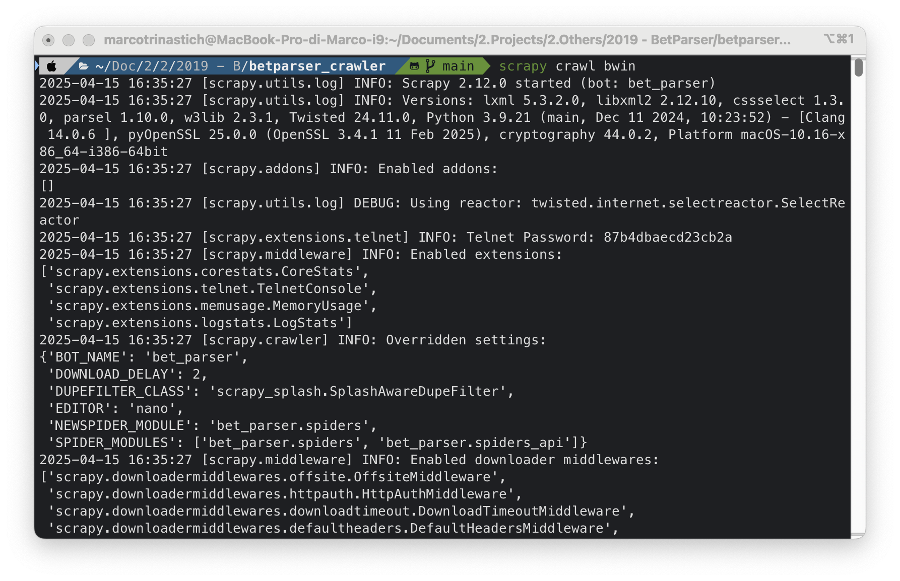

# BetParser Crawler

BetParser Crawler is a Python application designed to parse and extract betting odds from websites. It leverages the Scrapy framework, Firebase, custom Selenium integrations, and ML for efficient data extraction and processing.

## Disclaimer

This software is provided for educational and research purposes only. The authors of this project do not condone or encourage any illegal activities, including but not limited to unauthorized data scraping or infringement of intellectual property rights.

All trademarks, logos, and brand names mentioned in this project (e.g., Bwin, Bet365, William Hill, Sisal, Eurobet, etc.) are the property of their respective owners. The use of these names is for identification purposes only and does not imply endorsement or affiliation.

By using this software, you agree that the authors are not liable for any misuse or legal consequences arising from its use. It is your responsibility to ensure compliance with all applicable laws and regulations in your jurisdiction.

## Table of Contents

1. [Project Overview](#project-overview)
2. [Features](#features)
3. [Screenshots](#screenshots)
4. [Environment Setup](#environment-setup)
   - [Clone the Repository](#clone-the-repository)
   - [Setup Steps](#setup-steps)
   - [Selenium Configuration](#selenium-configuration)
   - [Firebase Configuration](#firebase-configuration)
5. [Usage](#usage)
   - [How to Run](#how-to-run)
   - [Machine Learning Mapper](#machine-learning-mapper)
6. [Development](#development)
   - [Scrapy Framework](#scrapy-framework)
   - [Debugging](#debugging)
   - [Testing](#testing)
7. [Extras](#extras)
   - [Splash Configuration](#splash-configuration)
   - [Tor and Proxy Configuration](#tor-and-proxy-configuration)
   - [Google Translator Mapper](#google-translator-mapper)
8. [Support](#support)
9. [License](#license)

## Project Overview

BetParser Crawler simplifies the process of extracting betting odds from web pages. It supports parsing complex JavaScript-powered pages using Selenium and includes machine learning algorithms to standardize team names. The project is highly configurable and integrates with Firebase for real-time database updates.

## Features

- **Web Scraping**: Extract betting odds from multiple websites using Scrapy spiders.
- **JavaScript Rendering**: Handle JavaScript-heavy pages with Selenium and Splash integrations.
- **Machine Learning**: Standardize team names using machine learning algorithms for word similarity.
- **Firebase**: Integrate with Firebase for real-time database updates.
- **Configurable Spiders**: Pre-configured spiders for well-known brokers like Bwin, Bet365, William Hill, Sisal, and Eurobet.
- **Proxy Support**: Enable proxy rotation and Tor to avoid bans during scraping.

## Screenshots

Here are some screenshots of the application in action:

### 1. Scrapy Spider Output



### 2. Selenium Middleware in Action


### 3. Machine Learning Mapper


### 4. Firebase Integration


## Environment Setup

### Clone the Repository

Clone this repository to your local machine using:

```bash
git clone https://github.com/mtmarco87/betparser_crawler.git
```

### Setup Steps

#### Install Anaconda3

- Download and install Anaconda3 with Python 3 from the [Anaconda Download Page](https://www.anaconda.com/distribution/#download-section).

#### Configure an Environment:

1. Open the Anaconda prompt.
2. Create a new environment with Python 3.9:
   ```bash
   conda create -n <env_name> python=3.9
   ```
3. Activate the environment:
   ```bash
   conda activate <env_name>
   ```

> Tip: Manage Conda environments with the following commands:
>
> - `conda activate <env_name>` - Activate an environment.
> - `conda deactivate` - Deactivate the current environment.
> - `conda env list` - List all environments.
> - `conda env remove -n <env_name>` - Remove an environment.

#### Install Libraries:

1. Install dependencies:
   ```bash
   pip install -r requirements.txt
   ```
2. Alternatively, install libraries individually:
   ```bash
   pip install Scrapy Scrapy-UserAgents scrapy-splash selenium firebase-admin numpy nltk Unidecode googletrans stem torrequest urllib3 requests pytz
   ```
3. If issues arise, install specific versions:
   ```bash
   pip install Scrapy==2.12.0 Scrapy-UserAgents==0.0.1 scrapy-splash==0.11.1 selenium==4.31.0 firebase-admin==6.7.0 numpy==2.0.2 nltk==3.9.1 Unidecode==1.3.8 googletrans==2.4.0 stem==1.7.1 torrequest==0.1.0 urllib3==2.4.0 requests==2.32.3 pytz==2025.2
   ```

### Selenium Configuration

> Selenium is a powerful tool for interacting with JavaScript-heavy pages. It allows automated web testing and renders pages as they would appear in a browser. BetParser includes a custom Scrapy-Selenium middleware for handling complex, JS/Angular-powered pages.

1. **Install Chrome or Firefox**:

   - Chrome (recommended):

     - Install [Chrome](https://www.google.com/chrome/).
     - (Optional) Download the [ChromeDriver](https://chromedriver.chromium.org/downloads) and place it in `bet_parser/libs/selenium_drivers/chromedriver`. If you skip this step, the middleware will automatically download the driver when needed.

   - Firefox:
     - Install [Firefox](https://www.mozilla.org/firefox/).
     - (Optional) Download the [GeckoDriver](https://github.com/mozilla/geckodriver/releases) and place it in `bet_parser/libs/selenium_drivers/geckodriver`. If you skip this step, the middleware will automatically download the driver when needed.

2. **Create a Chrome Browser Profile**:

   - Open Chrome and create a new user profile.
   - Locate the profile folder on your system (search online for instructions specific to your OS).
   - Copy the profile folder to: `bet_parser/libs/selenium_drivers/chrome_profiles`.

3. **Update Settings**:

   - Edit `bet_parser/settings.py` in the "Selenium config" section. Update the following:

   - `SELENIUM_CHROME_USER_DATA_DIR`: Path to the Chrome profile folder.
   - `SELENIUM_CHROME_DRIVER` (optional): Path to the ChromeDriver binary. Set to `None` for automatic driver management or specify the path if you want to use a custom driver.
   - `SELENIUM_FIREFOX_DRIVER` (optional): Path to the GeckoDriver binary. Set to `None` for automatic driver management or specify the path if you want to use a custom driver.

   - You only need to configure the settings for the browser you plan to use (Chrome or Firefox).

4. **Handle Protected Pages**:

   - Some websites allow pages to be displayed only after user interactions. Use the Chrome profile to manually visit these pages and accept any banners or prompts to generate valid cookies.
   - Selenium will use this profile to access these pages during scraping.

### Firebase Configuration

1. Create a Firebase account and database named `parsed_bets`.
2. Enable a Firebase app and download the service account key JSON file.
3. Copy the downloaded service account key JSON file to the `libs/firebase` directory in your project and rename it to `credentials.json` if necessary.
4. Update the Firebase configuration in `bet_parser/settings.py`:
   - Update `authDomain` and `databaseURL` with your Firebase project details.
   - Example:
     ```python
     FIREBASE_CONFIG = {
         "serviceAccountKeyPath": BOT_PATH + "/libs/firebase/credentials.json",
         "authDomain": "your-project-id.firebaseapp.com",
         "databaseURL": "https://your-project-id.firebaseio.com",
         "storageBucket": ""
     }
     ```

## Usage

### How to Run

Run a spider using the following command in the terminal from the project directory:

```bash
scrapy crawl <spider_name>
```

Replace `<spider_name>` with the name of the spider you want to run. All available spiders can be found in the `bet_parser/spiders` and `bet_parser/spiders_api` directories by checking the `name` field in each spider file.

### Machine Learning Mapper

After extracting betting odds, team names often appear in different formats or languages, making it difficult to identify unique matches. To address this, BetParser includes a machine learning-based mapper that standardizes team names using word similarity algorithms.

#### How It Works:

1. **Team Name Standardization**:

   - The mapper checks each team name against a pre-defined dataset (`team_names.csv`).
   - If a match is found, the standardized name is used.

2. **Handling Unknown Names**:

   - If no match is found, the name is logged in `to_validate.txt` for manual review.
   - This ensures new names are added to the dataset for future use.

3. **Manual Validation**:

   - Open `to_validate.txt` and compare each name with entries in `team_names.csv`.
   - If a name exists in another form or language, add the new form to `team_names.csv` and map it to the standardized name.
   - For completely new names, add them to `team_names.csv` with a standardized English version and any known variations.

4. **Improving Accuracy**:
   - Regularly update `team_names.csv` to reduce the size of `to_validate.txt`.
   - Add as many variations of team names as possible to avoid repeated manual validation.

#### Configuration:

- The mapper's behavior can be fine-tuned in the "Machine Learning config" section of `bet_parser/settings.py`.
- The current configuration is optimized for most scenarios but can be adjusted as needed.

This process ensures accurate and consistent team name mapping, which is critical for the crawler's functionality.

## Development

### Scrapy Framework

BetParser leverages the Scrapy framework for efficient web scraping. Scrapy allows you to define spiders to crawl websites and extract structured data, such as betting odds.

Key steps for working with Scrapy in this project:

1. **Add a new spider**:

   ```bash
   scrapy genspider <spider_name>
   ```

2. **Customize spiders**:
   - Modify the generated spider files in the `spiders/` directory to define the crawling logic and data extraction rules.
3. **Extend functionality**:
   - Use Scrapy middlewares, pipelines, and settings to customize the scraping process.

> Tip: BetParser's Selenium Middleware Features
>
> - Extracts data from JavaScript-heavy web pages.
> - Automatically creates a temporary copy of the Chrome profile to prevent bloating the folder.
> - `SeleniumRequest` parameters include:
>   - `driver`: Can be `'chrome'` or `'firefox'`.
>   - `render_js`: Set to `true` to extract the fully rendered DOM using JavaScript execution; set to `false` for standard HTML extraction with Selenium.
>   - `wait_time` and `wait_until`: Define wait conditions for page rendering.
>   - `headless`: Run in headless mode (no browser window).
>   - `script`: Execute custom JavaScript before extraction.

For more details, refer to the [Scrapy documentation](https://docs.scrapy.org/en/latest/).

### Debugging

#### VS Code

The repository includes a pre-configured `launch.json` for debugging Scrapy spiders. To use it:

1. Open the **Run and Debug** panel in VS Code (`Cmd+Shift+D` or `Ctrl+Shift+D`).
2. Select the `Scrapy Spider Debug` configuration.
3. Press the green "Start Debugging" button or hit `F5`.

To debug a different spider, edit the `"args"` field in `.vscode/launch.json`:

```jsonc
"args": ["crawl", "<spider_name>"] // Replace <spider_name> with your spider
```

Ensure the correct Python interpreter (e.g., Conda environment) is selected via **Python: Select Interpreter** in the Command Palette.

#### PyCharm

1. Open PyCharm and configure the project interpreter to use the environment created earlier.
2. Add a Python Run/Debug Configuration for each spider:
   - Script path: `<conda_env_path>/Lib/site-packages/scrapy/cmdline.py`
   - Parameters: `crawl <spider_name>`
   - Working directory: `<project_directory>`
   - Under Execution check Run with Python Console (else the Debug will work, but the Run will be broken)

### Testing

- Use the `scrapy check` command to validate spiders.

## Extras

### Splash Configuration

Use Splash as an alternative to Selenium for rendering and extracting data from complex JavaScript-powered pages:

1. Install Docker and run Splash:

   ```bash
   docker pull scrapinghub/splash
   docker run -p 8050:8050 scrapinghub/splash
   ```

2. Update `bet_parser/settings.py` to configure Splash.

### Tor and Proxy Configuration

Enable Tor or proxy rotation to avoid bans when requesting and parsing pages at high frequency. These features are experimental and may require additional refinement. To enable them, update the relevant settings in `bet_parser/settings.py`.

### Google Translator Mapper

A Google Translator-based mapper is available but less effective. To enable it, update the relevant settings in `bet_parser/settings.py`.

## Support

If you find this project useful, consider supporting its development:

- ⭐ Star the repository to show your appreciation.
- 💬 Share feedback or suggestions by opening an issue.
- ☕ [Buy me a coffee](https://buymeacoffee.com/mtmarco87) to support future updates and improvements.
- 🔵 BTC Address: `bc1qzy6e99pkeq00rsx8jptx93jv56s9ak2lz32e2d`
- 🟣 ETH Address: `0x38cf74ED056fF994342941372F8ffC5C45E6cF21`

## License

This project is licensed under the [MIT License](LICENSE). See the `LICENSE` file for details.
